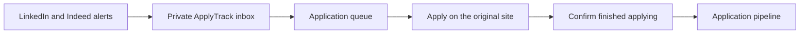

# ApplyTrack

> A private, focused workspace for managing a job search from first lead to final outcome.

[Live application](https://apply-track-six.vercel.app/) | [Public demo](https://apply-track-six.vercel.app/#/demo)

ApplyTrack brings applications, interviews, follow-ups, offers, and rejections into one clear pipeline. It was created to replace the mix of spreadsheets, browser tabs, and reminders that often grows around an active job search.

The project combines a practical application tracker with a user-controlled Job Agent. LinkedIn and Indeed alerts can be forwarded into a private queue, reviewed in ApplyTrack, and moved into the application pipeline after the user applies on the original site.

## The Product

ApplyTrack is designed around a simple workflow:

1. Capture an opportunity manually, from Excel, or from a job-alert email.
2. Track its current stage and the next action required.
3. Record interviews, follow-ups, offers, and final outcomes.
4. Review progress over time without losing the detail behind the numbers.

The interface is built as a working product rather than a marketing dashboard. Dense application data remains scannable, important actions stay visible, and the layout adapts across desktop, tablet, and mobile screens.

## Core Experience

### Application Pipeline

- Board and list views for active applications
- Applied, interview, offer, and rejected stages
- Search, status filters, date sorting, pagination, and multi-select actions
- Detailed application records with follow-up dates, notes, referrals, cover letters, and interview rounds
- Automatic last-updated tracking when an application changes

### Progress and Activity

- Outcome pipeline visualization
- Interview counts based on actual interview rounds, not only current status
- Weekly activity calendar showing applications and rejections
- Clear totals for applications, interviews, offers, and rejected roles

### Flexible Data Entry

- Focused add and edit application forms
- Excel import with row preview and per-application selection
- Public demo data for portfolio previews without requiring an account

### Profile and Account

- Username-based authentication
- Optional recovery email and password reset flow
- Session behavior designed for a personal workspace

## Job Agent

The Job Agent reduces the distance between discovering a role and tracking the completed application. It uses job alerts the user already configured on LinkedIn and Indeed, so search preferences remain under the user's control on those platforms.



The current Job Agent includes:

- A private forwarding address for LinkedIn and Indeed alerts
- Signed Resend inbound webhook processing
- Message and job deduplication
- A single queue of jobs waiting to be applied to
- Direct links back to the source platform
- One-click creation of a populated pipeline record after applying
- Removal of roles that are not a good fit

ApplyTrack does **not** scrape job sites, store LinkedIn or Indeed credentials, or silently submit applications. The user reviews each role and completes the application on its original site before confirming it in ApplyTrack.

## Product Principles

- **Keep the next action visible.** The product should make it obvious what needs attention.
- **Make information scannable.** Job-search data is dense, so structure matters more than decoration.
- **Use familiar controls.** Forms, filters, sorting, navigation, and destructive actions should behave as expected.
- **Respect private data.** Applications and account recovery information belong to the user.
- **Stay user-controlled.** Automation should remove repetitive work without making decisions or submissions invisibly.

## Architecture

ApplyTrack is a React single-page application backed by Supabase.

```text
React 19 + Vite
        |
        +-- Supabase Auth and session management
        +-- Postgres application and Job Agent data
        +-- Row Level Security for user-owned records
        +-- Edge Functions for recovery and inbound email
        |
        +-- Resend for email delivery and job-alert ingestion
        +-- Recharts for progress visualization
        +-- xlsx for spreadsheet imports
```

The frontend uses lightweight hash routing and separates route-level pages, reusable components, API helpers, data normalization, and service integrations.

## Privacy and Trust

- Every application and Job Agent record is scoped to its owner through Supabase Row Level Security.
- Service-role credentials are restricted to server-side Edge Functions.
- Resend webhook signatures are verified before inbound alerts are processed.
- Raw job-alert email bodies and attachments are not retained.
- Public password-recovery responses do not reveal whether an account exists.
- Browser-visible Supabase credentials are limited to the publishable key.

## Project Status

ApplyTrack currently supports the complete tracking workflow, spreadsheet migration, progress reporting, account management, and LinkedIn/Indeed alert ingestion. The Job Agent is intentionally assisted rather than fully autonomous: it prepares a queue and records completed applications while the user remains responsible for reviewing and submitting each application.

Future work is focused on link-based application prefill and browser-assisted form support while preserving this user-controlled boundary.

## Technology

| Area | Tools |
| --- | --- |
| Frontend | React 19, Vite 8 |
| Backend | Supabase Auth, Postgres, Storage, RLS, Edge Functions |
| Visualization | Recharts |
| Spreadsheet processing | xlsx |
| Email | Resend |
| Deployment | Vercel |

## Run Locally

```powershell
npm install
Copy-Item .env.example .env.local
npm run dev
```

Add the Supabase project URL and publishable key to `.env.local`, then run `supabase/schema.sql` in the Supabase SQL Editor. The local application is normally available at `http://127.0.0.1:5173`, with the public demo at `http://127.0.0.1:5173/#/demo`.

<details>
<summary><strong>Environment and service configuration</strong></summary>

The browser environment supports these values:

```env
VITE_SUPABASE_URL=https://your-project.supabase.co
VITE_SUPABASE_PUBLISHABLE_KEY=your-publishable-key
VITE_JOB_ALERT_INBOUND_DOMAIN=alerts.your-domain.com
```

Only `.env.example` should be committed. Keep `.env.local`, Supabase service-role credentials, Resend secrets, and Edge Function environment files private.

For an existing Supabase project, apply the migrations in `supabase/migrations/` or run:

```powershell
npx supabase db push
```

To activate inbound LinkedIn and Indeed alerts, configure a Resend receiving domain, subscribe an `email.received` webhook to the public `ingest-job-alert` Edge Function, set its server-side secrets, and deploy it:

```powershell
npx supabase secrets set RESEND_API_KEY=re_your_api_key
npx supabase secrets set RESEND_WEBHOOK_SECRET=whsec_your_webhook_secret
npx supabase secrets set INBOUND_EMAIL_DOMAIN=alerts.your-domain.com
npx supabase functions deploy ingest-job-alert --no-verify-jwt
```

To activate password recovery, configure the Resend sender, application URL, and allowed redirect origins before deploying the recovery function:

```powershell
npx supabase secrets set RESEND_API_KEY=re_your_api_key
npx supabase secrets set "PASSWORD_RESET_FROM_EMAIL=ApplyTrack <noreply@your-domain.com>"
npx supabase secrets set APP_URL=https://your-deployment.example
npx supabase secrets set "ALLOWED_REDIRECT_ORIGINS=http://localhost:5173,http://127.0.0.1:5173,https://your-deployment.example"
npx supabase functions deploy request-password-reset
```

</details>

## Development Commands

| Command | Purpose |
| --- | --- |
| `npm run dev` | Start the Vite development server |
| `npm run build` | Create a production build |
| `npm run lint` | Run ESLint |
| `npm test` | Run the project unit tests |
| `npm run preview` | Preview the production build locally |

## Project Structure

```text
src/
  api/          Supabase API helpers
  components/   Shared React components
  data/         Defaults and normalization helpers
  lib/          Supabase client setup
  pages/        Route-level views
  styles/       Theme and responsive styles
  utils/        Routing, storage, parsing, and import utilities
supabase/
  functions/    Edge Functions
  migrations/   Incremental database migrations
  schema.sql    Database schema and RLS policies
docs/           Product implementation plans
```

## Project Documentation

- [Product direction](PRODUCT.md)
- [Design system and interface guidance](DESIGN.md)
- [Agent development guide](AGENTS.md)
- [Job Agent implementation plan](docs/job-agent-implementation-plan.md)
- [LinkedIn and Indeed alert-ingestion plan](docs/linkedin-indeed-alert-ingestion-plan.md)
