# ApplyTrack Job Agent Implementation Plan

> Discovery uses user-authorized LinkedIn and Indeed alert emails. See `docs/linkedin-indeed-alert-ingestion-plan.md` for the active ingestion architecture.

Status: Profile, resume, alert ingestion, matching, and review implemented
Last updated: 2026-07-22

## Objective

Add an opt-in job agent that can:

1. Store a user's resume, job preferences, and reusable application answers.
2. Ingest jobs from LinkedIn and Indeed alert emails as they arrive.
3. Normalize, deduplicate, and rank new jobs against the user's goals.
4. Apply through supported portals when the user has explicitly enabled automation.
5. Record every discovered job, application attempt, answer, result, and failure in ApplyTrack.

The feature should improve application throughput without making false claims, submitting incorrect answers, bypassing portal security, or silently applying outside the user's rules.

## Product Modes

Users should choose one automation level per search profile:

- **Discover only:** Save matching jobs for review. Never apply.
- **Review before applying:** Prepare an application and wait for approval. This should be the default.
- **Auto-apply to trusted portals:** Submit only when every required field can be answered from approved profile data and the portal is on the user's allowlist.

Any job that needs a new account, CAPTCHA, MFA, assessment, unsupported question, or unclear answer should pause and become a manual task.

## System Architecture

```mermaid
flowchart LR
  Alerts["LinkedIn and Indeed alerts"] --> Mailbox["Private forwarding address"]
  Mailbox --> Ingest["Signed inbound email function"]
  Ingest --> Sources["Provider-specific parsers"]
  Sources --> Leads["Normalized job leads"]
  Leads --> Match["Rule and relevance scoring"]
  Match --> Queue["Application queue"]
  Queue --> Review["User review"]
  Queue --> Runner["Automation worker"]
  Review --> Runner
  Runner --> Portals["Supported ATS portal adapters"]
  Portals --> Events["Application run and audit events"]
  Events --> Tracker["ApplyTrack applications"]
```



The React client remains the control surface. Inbound email processing and future browser automation run server-side so they do not depend on the user's tab being open and do not expose privileged credentials in Vite variables.

## Proposed Data Model

All user-owned tables must have RLS policies scoped with `auth.uid() = user_id`.

### `job_agent_profiles`

- `id`, `user_id`
- `display_name`, `phone`, `location`
- `work_authorization`, `sponsorship_required`
- reusable answers stored as structured JSON
- `automation_mode`
- `enabled`
- timestamps

### `resumes`

- `id`, `user_id`
- private storage path, original filename, MIME type
- extracted text and structured skills
- `is_primary`
- timestamps

Resume files should live in a private Supabase Storage bucket. Generate short-lived signed URLs only when an authorized worker needs the file.

### `job_searches`

- `id`, `user_id`
- titles, locations, remote preference
- salary floor, employment types, keywords
- excluded companies and keywords
- enabled flag

### `job_leads`

- `id`, `user_id`, `job_search_id`
- source and external source ID
- canonical URL and apply URL
- company, title, location, description
- discovered and posted timestamps
- deduplication fingerprint
- match score and score explanation
- state: `new`, `shortlisted`, `dismissed`, `queued`, `applied`, or `expired`

Add a unique constraint that prevents the same source job from being inserted twice for one user.

### `application_runs`

- `id`, `user_id`, `job_lead_id`
- portal type and automation mode
- state: `queued`, `running`, `needs_input`, `submitted`, `failed`, or `cancelled`
- attempt count and idempotency key
- timestamps, failure category, and safe error summary
- linked `applications.id` after submission

### `application_events`

- `id`, `user_id`, `application_run_id`
- event type and timestamp
- redacted metadata JSON

Events form the audit trail. Do not store passwords, session cookies, resume contents, or sensitive answers in event metadata.

## Service Boundaries

### 1. Profile and resume service

- Add a Job Agent setup page.
- Collect job goals, exclusions, automation level, consent, and reusable answers.
- Upload resumes to private storage.
- Extract text in a server-side function and let the user correct the resulting profile.
- Require the user to approve the data before it can be used for submissions.

### 2. Job alert ingestion service

- Receive user-forwarded LinkedIn and Indeed job-alert emails through Resend Inbound.
- Put each provider parser behind a common normalized result shape.
- Process each signed webhook once and retain safe ingestion metadata.
- Deduplicate before scoring.
- Record parser failures without discarding other valid jobs in the same alert.

Potential later adapters can include official employer feeds and ATS job-board APIs such as Greenhouse or Lever where their public endpoints permit it. Provider terms and rate limits must be reviewed before production use.

### 3. Matching service

Use a transparent two-stage matcher:

1. Hard filters for location, work type, excluded companies, authorization requirements, and salary rules.
2. A relevance score using title, skills, experience, and keywords from the approved profile and resume.

Show users why a job matched. An optional language model can help extract structured requirements, but final eligibility rules should remain deterministic and testable.

### 4. Application orchestration service

The orchestrator decides whether a lead can be submitted automatically:

- Verify the lead has not already been applied to.
- Verify the current portal is supported and allowed by the user.
- Verify all required answers come from approved profile fields.
- Acquire an idempotency lock so retries cannot create duplicate applications.
- Create an `application_run` before opening the portal.
- Delegate to the correct portal adapter.
- Persist each state transition and the final result.
- Create an ApplyTrack application only after a confirmed submission, or label an uncertain result for user review.

### 5. Portal adapters

Use Playwright or a managed browser automation service for known portals. Each adapter should expose a small contract such as:

```text
detect(job)
prepare(job, profile, resume)
validate(preparedApplication)
submit(preparedApplication, browserSession)
readResult()
```

Build adapters one portal at a time. A Greenhouse or Lever adapter is a reasonable first target; Workday and custom employer portals should come later because account, session, and form behavior varies considerably.

For account-based portals:

- Let the user connect or create the account interactively.
- Store an encrypted browser session through the automation provider when supported.
- Never store portal passwords in the ApplyTrack database.
- Pause for the user when MFA, CAPTCHA, email verification, or changed terms appear.
- Never attempt to bypass anti-bot controls.

## Ingestion And Deployment

- Use a public Supabase Edge Function that verifies Resend webhook signatures before processing.
- Process alerts immediately when they arrive rather than polling on a schedule.
- Run browser automation in a worker environment designed for longer jobs, such as a managed browser service or a dedicated worker.
- Use signed requests between Supabase and the worker.
- Keep service-role keys, job-provider keys, automation credentials, and encryption keys server-side only.

Every inbound event should be idempotent and safe to retry. Add per-user and global limits so malformed or repeated messages cannot create an application flood.

## User Experience

Add these authenticated views:

- **Job Agent setup:** resume, profile answers, search goals, exclusions, mode, and consent.
- **Matches:** new jobs with score reasons, source, discovered time, and actions to approve or dismiss.
- **Queue:** prepared, running, paused, and failed applications.
- **Run detail:** an audit timeline with a clear next action when user input is required.

The existing dashboard should show a compact agent summary, not a second full job board:

- New matches
- Awaiting review
- Submitted automatically
- Needs input
- Last alert received and latest import status

## Safety And Trust Rules

- Default to review before applying.
- Require explicit opt-in before any automatic submission.
- Show exactly which resume and profile answers will be used.
- Never fabricate qualifications, work authorization, salary expectations, demographic data, or legal attestations.
- Do not answer voluntary self-identification questions unless the user explicitly supplies and approves those answers.
- Cap applications per run and per day.
- Support company, title, keyword, location, and portal blocklists.
- Provide a global pause control and an immediate way to cancel queued runs.
- Keep a complete, redacted audit trail.
- Publish a privacy and data-retention explanation before enabling production automation.

## Implementation Phases

### Current implementation status

- **Phase 1 complete:** user-scoped profile, resume, search, alert-message, and lead tables; private Storage policies; grants hardened after a live advisor audit.
- **Phase 2 complete:** setup UI, reusable answers, resume upload, local PDF/DOCX/TXT extraction, approval, and readiness checks.
- **Phase 3 complete:** signed Resend inbound webhook, LinkedIn and Indeed parsers, normalization, deduplication, and ingestion history.
- **Phase 4 complete:** deterministic hard filters, a 0-100 relevance score, match explanations, filtered reasons, search, tabs, selection, and bulk save/dismiss/restore actions.

Resume extraction runs locally in the browser instead of in an Edge Function. This keeps the raw document processing on the user's device while the original file and user-approved text remain protected by private Storage and RLS.

### Phase 1: Foundation and schema

- Add the six proposed data areas and user-scoped RLS.
- Add private resume storage policies.
- Add API helpers and shared normalized types.
- Add a feature flag so unfinished agent routes stay disabled in production.

Exit criteria: authenticated users can create isolated profiles and searches; cross-user access tests fail as expected.

### Phase 2: Profile and resume setup

- Build profile, preference, reusable-answer, and resume upload flows.
- Add server-side resume extraction.
- Add a review screen and readiness checklist.

Exit criteria: a user can complete and approve a reusable job-agent profile without exposing private files publicly.

### Phase 3: Alert ingestion

- Integrate LinkedIn and Indeed email alerts.
- Add signed webhook processing, normalization, deduplication, and ingestion history.
- Build the Matches view.

Exit criteria: repeated alerts add only genuinely new leads and explain parser failures clearly.

### Phase 4: Matching and review queue

- Add hard filters and relevance scoring.
- Explain match reasons and rejected filters.
- Let users approve, dismiss, and bulk-manage leads.

Exit criteria: users can understand and correct why jobs are included.

### Phase 5: Assisted application for one portal

- Implement one portal adapter.
- Pre-fill an application and stop before final submission.
- Surface unsupported fields and let users save approved answers.

Exit criteria: the same test application can be prepared reliably without duplicate records or hidden answers.

### Phase 6: Controlled auto-submit

- Enable submission only for the tested portal and explicit allowlisted searches.
- Add idempotency locks, daily caps, retries, audit events, and global pause.
- Record confirmed submissions in the existing applications table.

Exit criteria: a failed or retried run cannot submit twice, and every submission can be traced to its approved inputs.

### Phase 7: Expand portal and source coverage

- Add adapters according to observed user demand.
- Add interactive account/session connection.
- Add monitoring, alerting, retention controls, and operating-cost limits.

Exit criteria: each new adapter passes the same fixture, sandbox, idempotency, and failure-recovery tests.

## Testing Strategy

- Unit tests for normalization, deduplication, filters, scoring, and answer resolution.
- RLS tests for every new table and storage policy.
- Contract fixtures for each job-source adapter.
- Portal-adapter tests against controlled test pages before real portals.
- End-to-end tests for discover, approve, queue, submit, and record flows.
- Failure tests for expired jobs, changed forms, missing fields, CAPTCHA, MFA, timeouts, and retries.
- A dry-run mode that exercises discovery and preparation without submitting.

## Observability

Track:

- alert imports received, completed, partially processed, and failed
- jobs fetched, deduplicated, filtered, and matched
- applications queued, paused, submitted, and failed
- duplicate-prevention events
- portal-specific success rates and median run time
- provider usage and cost per successful submission

Logs must use IDs and redacted metadata rather than personal answers or resume text.

## Initial Delivery Recommendation

The first useful release stops at Phase 4: profile, resume, alert ingestion, transparent matching, and a review queue. This validates job quality before the project takes on the cost and fragility of portal automation.

The first automation milestone should then support one portal in assisted mode. Fully automatic submissions should be enabled only after that adapter proves reliable and the duplicate, consent, and audit controls are in place.

## Decisions To Approve Before Implementation

1. The first job source and its allowed use, rate limits, and cost.
2. The first supported application portal.
3. Whether the initial release ends at discovery/review or includes assisted form filling.
4. Daily and per-run application limits.
5. Resume retention and deletion policy.
6. Whether a managed browser provider or a dedicated worker will run automation.
7. Which answers always require manual confirmation.
