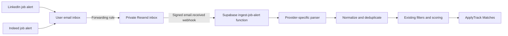

# ApplyTrack LinkedIn and Indeed Alert Ingestion Plan

Status: Phases 1-5 implemented and live-email validation completed
Last updated: 2026-07-22

## Decision

Use user-authorized ingestion of LinkedIn and Indeed job-alert emails as the Job Agent discovery source.

ApplyTrack will not scrape LinkedIn or Indeed, automate their websites, store their login credentials, or claim to search either platform directly. Users will create alerts on those platforms and forward the resulting emails to a private ApplyTrack inbox. ApplyTrack will extract the job cards and links from those emails, deduplicate them, score them with the existing profile and resume, and place them in the existing Matches workflow.

The resume, profile, targeting preferences, deterministic matching, filters, review states, and private Supabase storage already implemented remain useful and should be preserved.

## Product Truths

- ApplyTrack receives only the jobs included in the user's alert emails. It does not receive every job listed on either platform.
- Delivery cadence is controlled by LinkedIn and Indeed. LinkedIn officially supports daily or weekly alerts, not an every-three-hours feed.
- Ingestion should run as soon as an alert email arrives. A three-hour polling cron is unnecessary.
- Links from alert emails may open a LinkedIn or Indeed listing rather than the employer's original application page.
- LinkedIn Easy Apply and Indeed Apply remain manual. ApplyTrack must not automate those websites without written platform authorization.
- Jobs that link to an external supported ATS can later enter the assisted-application workflow described in the broader Job Agent plan.

## Target Experience

1. The user completes the existing Job Agent profile, resume, and targeting preferences.
2. ApplyTrack generates a private forwarding address for that user.
3. The user creates LinkedIn and Indeed alerts and enables email delivery.
4. The user creates an email forwarding rule for those alert emails.
5. A Resend inbound webhook notifies a Supabase Edge Function when an alert arrives.
6. The function verifies the webhook, retrieves the email, identifies its platform, and parses its job cards.
7. Jobs are normalized, deduplicated, scored, and added to Matches.
8. The user saves, dismisses, or opens the listing on its source platform.



## Accounts And Services

### Required Accounts

| Account | Purpose | New account needed? |
| --- | --- | --- |
| LinkedIn | Create job alerts and deliver them by email | Required; an ordinary free account is sufficient |
| Indeed | Create job alerts and deliver them by email | Required; an ordinary job-seeker account is sufficient |
| Personal email provider | Receive the alerts and forward matching messages | Existing Gmail, Outlook, or another provider is sufficient |
| Resend | Receive forwarded alerts and send signed webhook events | Already used by ApplyTrack; Inbound must be enabled |
| Supabase | Store inbox mappings, ingestion history, and job leads; run the webhook function | Already used by ApplyTrack |
| Vercel | Host the React application | Already used by ApplyTrack |
| GitHub | Source control and Vercel deployment integration | Already used by ApplyTrack |

### Optional Accounts

| Account | Why it might be useful |
| --- | --- |
| Custom domain registrar/DNS provider | Provides a branded address such as `alerts@jobs.applytrack.app`; not required because Resend can provide a managed receiving domain |
| Error monitoring service such as Sentry | Alerts the developer when LinkedIn or Indeed changes an email template and parsing starts failing |

### Accounts That Are Not Required

- No LinkedIn developer or Talent Solutions account.
- No Indeed developer account or publishing-partner access.
- No Gmail or Microsoft Graph API access for the first release.
- No LinkedIn or Indeed passwords stored by ApplyTrack.
- No browser automation provider for alert ingestion.

## Development Tools

- Node.js and npm for the existing React/Vite app.
- Supabase CLI for migrations, secrets, function deployment, and logs.
- Supabase SQL Editor for production migration review and verification.
- Resend dashboard and SDK/API for Inbound configuration and email retrieval.
- A DOM-based HTML parser compatible with the Supabase Deno runtime. Do not parse alert HTML with broad regular expressions.
- Existing Node test runner for parser, normalization, deduplication, and matching tests.
- Sanitized LinkedIn and Indeed alert-email fixtures supplied by the developer's own accounts.

## Required Secrets And Configuration

Store these only as Supabase project secrets:

- `RESEND_API_KEY`: retrieves the full body of a received email.
- `RESEND_WEBHOOK_SECRET`: verifies that webhook requests were sent by Resend.
- `INBOUND_EMAIL_DOMAIN`: the Resend-managed or custom receiving domain.

Do not place these values in `VITE_` variables or in Git.

## Data Model Changes

All exposed user-owned tables must have RLS enabled and ownership policies using `(select auth.uid()) = user_id`. Webhook-only tables should not be writable from the browser.

### `job_alert_inboxes`

Maps a private recipient alias to one ApplyTrack user.

- `id`
- `user_id`, unique
- `address_alias`, unique; a random capability value protected by RLS and treated as private
- `enabled`
- `last_received_at`
- `created_at`, `updated_at`

Generate aliases with at least 128 bits of randomness. Do not derive them directly from a user ID, username, or email address. The full address must remain available only to its owner and the server-side ingestion function so the setup page can display and copy it.

### `job_alert_messages`

Records processing without retaining full email content.

- `id`
- `user_id`
- `provider`: `linkedin`, `indeed`, or `unknown`
- `resend_email_id`, unique
- `internet_message_id`, nullable
- `status`: `received`, `processing`, `completed`, `partial`, `failed`, or `ignored`
- `jobs_found`, `jobs_created`, `jobs_updated`
- `parser_version`
- `safe_error_summary`
- `received_at`, `processed_at`

The browser may read only its owner's safe status rows. Insert and processing updates belong to the server-side function.

### `job_leads`

Keep the existing table and matching fields. Adapt it as follows:

- `source` becomes `linkedin` or `indeed` for new alert-derived records.
- `external_id` uses the platform job ID where available; otherwise use a deterministic URL fingerprint.
- `canonical_url` stores a normalized LinkedIn or Indeed listing URL.
- `apply_url` stores the best link present in the alert.
- Add `source_message_id` as a nullable foreign key for traceability.
- Preserve `match_score`, reasons, filter state, review state, and user ownership.
- Keep the unique `(user_id, source, external_id)` constraint.

### `job_searches`

Keep targeting preferences because they drive scoring and filtering. Alert-source connection status replaces provider scheduling fields in the UI.

### Ingestion history

`job_alert_messages` is the sole ingestion-history record. The obsolete scheduled-run table has been removed.

## Inbound Security Model

The webhook endpoint is public because Resend cannot provide a Supabase user JWT. Configure the function with JWT verification disabled, then perform all authorization inside the handler.

The function must:

1. Read the raw request body before parsing JSON.
2. Verify the Resend webhook signature and timestamp with `RESEND_WEBHOOK_SECRET`.
3. Reject replayed webhook IDs and duplicate `resend_email_id` values.
4. Resolve the recipient alias to exactly one enabled user.
5. Retrieve full email content through the Resend API using the server-side API key.
6. Treat sender names and addresses as classification signals, not as sufficient authorization.
7. Accept only links with expected HTTPS hosts and protocols.
8. Sanitize HTML and never render inbound HTML inside ApplyTrack.
9. Use the service-role key only inside the function and never return it or private email content.
10. Log IDs and safe statuses, not email bodies, profile answers, or resume text.

## Parser Design

Implement separate, versioned parsers:

```text
detectProvider(email)
parseLinkedInAlert(email)
parseIndeedAlert(email)
normalizeAlertJob(parsedJob)
canonicalizePlatformUrl(url)
```

Each parser should:

- Parse the HTML into a DOM.
- Locate job-card anchors using several stable structural signals.
- Extract title, company, location, and listing URL when present.
- Extract a platform job ID from the URL when possible.
- Remove tracking parameters that are unnecessary for identifying duplicates while preserving parameters required to open the listing.
- Return partial jobs when a nonessential field is absent.
- Reject entries without a usable job title and HTTPS listing URL.
- Record the parser version used for every message.

Do not follow links to crawl LinkedIn or Indeed. The email itself is the complete ingestion boundary.

## Deduplication And Matching

Use two deduplication layers:

1. Exact platform identity: `(user_id, source, external_id)`.
2. Cross-alert fallback: normalized source URL fingerprint when the platform ID is unavailable.

After deduplication, reuse the existing deterministic matcher:

- hard filters for exclusions, location, arrangement, seniority, employment type, and salary when available
- relevance scoring using titles, keywords, skills, and resume/profile data
- visible match and filter reasons

Email alerts often omit salary, full descriptions, and employment type. Missing values must remain unknown rather than being inferred as facts.

## Product Changes

### Job Agent Setup

Use a **Connect job alerts** section:

- Generate or rotate private forwarding address.
- Copy-address button.
- LinkedIn setup instructions.
- Indeed setup instructions.
- Generic Gmail and Outlook forwarding-rule guidance.
- Connection status for each source.
- Send-a-test-email verification state.
- Pause ingestion and rotate-address controls.

### Matches

- Show alert connection and import status instead of polling controls.
- Show **Last alert received** and **Last processed**.
- Add source filters for LinkedIn and Indeed.
- Label actions **View on LinkedIn** and **View on Indeed**.
- Show an ingestion warning when a parser partially fails.
- Keep search, pagination, save, dismiss, restore, and match explanations.

### Dashboard

Show a compact status:

- New matches
- LinkedIn alerts connected/not connected
- Indeed alerts connected/not connected
- Last alert received
- Alerts needing attention

## Migration And Cutover

The production cutover is complete:

1. Add the new inbox and message tables, RLS policies, indexes, grants, and lead traceability column.
2. Deploy `ingest-job-alert` with platform JWT verification disabled and Resend signature verification enabled.
3. Configure the Resend `email.received` webhook.
4. Release the Connect job alerts UI.
5. Test one LinkedIn and one Indeed forwarded alert end to end.
6. Retire the obsolete scheduled-discovery function, cron, secrets, scan history, and legacy leads.

## Implementation Phases

### Phase 1: Schema And Inbox Identity

- Create the inbox and message tables.
- Add RLS and server-only write permissions.
- Generate, rotate, pause, and display private aliases.
- Add source-message traceability to leads.

Exit criteria: two users cannot view or use each other's inbox or message records, and aliases cannot be guessed from account data.

### Phase 2: Secure Resend Inbound Function

- Create `ingest-job-alert`.
- Verify signatures and prevent replay.
- Retrieve full content through Resend.
- Resolve the private alias to a user.
- Record idempotent processing status.

Exit criteria: valid test webhooks are accepted once; invalid, replayed, or unknown-recipient events create no leads.

### Phase 3: LinkedIn And Indeed Parsers

- Add sanitized fixtures from real alert emails.
- Implement provider detection and versioned parsers.
- Canonicalize links and extract job IDs.
- Normalize and deduplicate parsed jobs.
- Reuse the current matcher.

Exit criteria: repeated delivery of the same email or job creates no duplicate lead, and parser failures are visible without losing other valid jobs in the message.

### Phase 4: Connection And Matches UI

- Add forwarding-address onboarding and connection states.
- Show alert status and import history.
- Add source filters and accurate link labels.
- Add troubleshooting for missing or malformed alerts.

Exit criteria: a new user can connect both sources without developer assistance and see a forwarded alert appear in Matches.

### Phase 5: Legacy Discovery Retirement

- Use alert ingestion as the only discovery source.
- Unschedule and remove the obsolete polling job.
- Remove obsolete provider secrets and function code.
- Remove legacy provider leads after the validation window.
- Update README and the broader Job Agent plan.

Exit criteria: all new leads originate from LinkedIn or Indeed alert emails and no obsolete discovery infrastructure remains.

## Test Plan

### Unit Tests

- Provider detection for valid and misleading sender/subject combinations.
- LinkedIn parser against multiple alert layouts.
- Indeed parser against multiple alert layouts.
- URL allowlisting and canonicalization.
- Platform job ID extraction.
- Partial-card handling.
- Duplicate email and duplicate job handling.
- Existing matching behavior with sparse email fields.

### Security Tests

- Invalid and missing webhook signatures.
- Replayed webhook event.
- Unknown, disabled, and rotated recipient aliases.
- Cross-user inbox and message access through the Data API.
- Malicious HTML, script tags, non-HTTPS links, and oversized bodies.
- Spoofed sender address containing non-platform links.
- Confirmation that logs and API responses contain no raw email body.

### End-To-End Tests

- LinkedIn alert forwarded through a real mailbox rule.
- Indeed alert forwarded through a real mailbox rule.
- Two alerts containing the same job.
- Parser template drift resulting in a safe partial-failure status.
- Paused inbox receives no new leads.
- Rotated address invalidates the previous alias.

## Monitoring And Maintenance

Track:

- messages received, completed, partial, ignored, and failed
- jobs parsed, created, updated, and deduplicated by source
- parser version and failure rate
- time from email receipt to visible match
- last successful alert per user and provider
- webhook signature and replay failures without storing message content

LinkedIn and Indeed can change email templates without notice. A parser failure-rate alert and fixture-based regression tests are required maintenance, not optional polish.

## Privacy And Retention

- Store parsed job fields and processing metadata, not full alert email bodies.
- Retrieve the body only while processing and discard it afterward.
- Avoid storing tracking pixels, unsubscribe links, unrelated recommendations, or mailbox headers unless required for deduplication.
- Provide inbox pause, alias rotation, and source-data deletion controls.
- Document that forwarded emails are processed by Resend and Supabase.
- Review Resend's current inbound retention behavior before production launch.

## Known Limitations

- LinkedIn alerts are daily or weekly, so ApplyTrack cannot guarantee discovery within three hours.
- Indeed alert frequency and content can vary by account, location, and search.
- Alerts may contain only a subset of platform results.
- Email templates and tracking links can change.
- The system cannot inspect jobs that were never included in an alert email.
- The system cannot safely auto-submit LinkedIn Easy Apply or Indeed Apply applications.

## Recommended First Release

Phases 1 through 5 are complete. Continue validating parser quality against real alerts and add sanitized regression fixtures whenever either provider changes its email template.

## User Setup Checklist

1. Keep or create ordinary LinkedIn and Indeed job-seeker accounts.
2. Create focused alerts for the desired titles and locations.
3. Enable email delivery; use daily LinkedIn alerts for the fastest officially supported cadence.
4. Enable Resend Inbound using a managed receiving domain or a custom subdomain.
5. Add the Resend API key and webhook signing secret to Supabase secrets.
6. Deploy the inbound Edge Function.
7. Add the `email.received` webhook in Resend.
8. Copy the private ApplyTrack forwarding address.
9. Create mailbox rules that forward only LinkedIn and Indeed job-alert messages.
10. Send or wait for one alert from each source and confirm it appears in Matches.

## Reference Documentation

- [LinkedIn job alerts](https://www.linkedin.com/help/linkedin/answer/a511279/job-alerts-on-linkedin)
- [LinkedIn prohibited software and extensions](https://www.linkedin.com/help/linkedin/answer/a1341387)
- [Indeed job alerts](https://support.indeed.com/hc/en-us/articles/204488890-Starting-Stopping-and-Managing-Job-Alerts)
- [Indeed Publisher JavaScript Plugin partner requirements](https://docs.indeed.com/indeed-plus/publisher-js-plugin)
- [Resend Inbound receiving](https://resend.com/docs/dashboard/receiving/introduction)
- [Resend received-email content API](https://resend.com/docs/dashboard/receiving/get-email-content)
- [Supabase Edge Functions](https://supabase.com/docs/guides/functions)
- [Supabase external webhook security](https://supabase.com/docs/guides/functions/auth)
